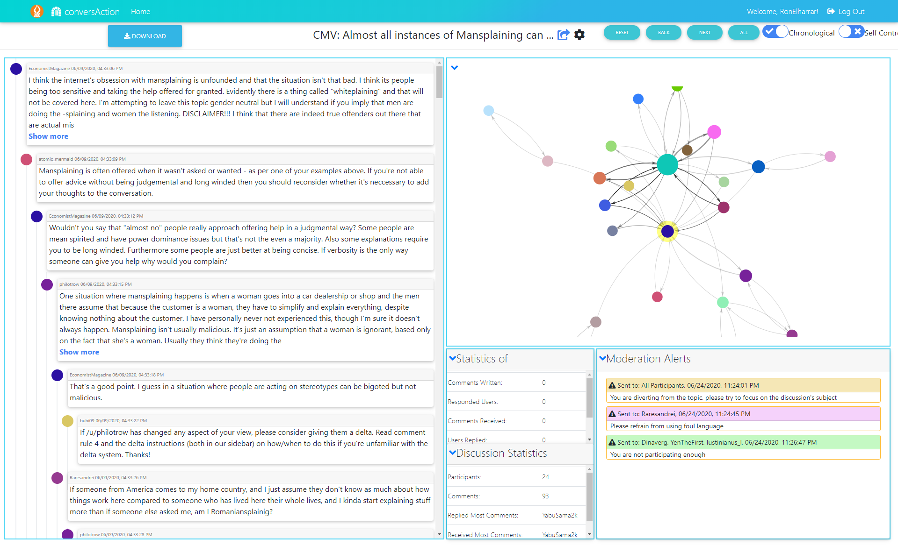

# Kamin-Client

Kamin-Client is a ReactJS code repository of a deployed web app, for conducting experiments of non-convergent discussions, with integration ready advanced visualizations
This repository contains the code for client side of the web application:



## Getting Started

* Make sure you have nodejs installed in order to use node package manager (npm) https://nodejs.org/en/

* Make sure kamin-server is up & running - https://github.com/RonElhar/Kamin-Server/ see README.

* After cloning the repositoy to your preffered code editor, open the terminal and execute the following command:
    ```bash
    npm install
    ```
* After installation is finished execute:
    ```bash
    npm start
    ```

And your browser will open kamin application at http://localhost:3000/

## To Use Deployment Version

Visit us at http://conversaction.tk:3000/ in order to use the deployed web app

